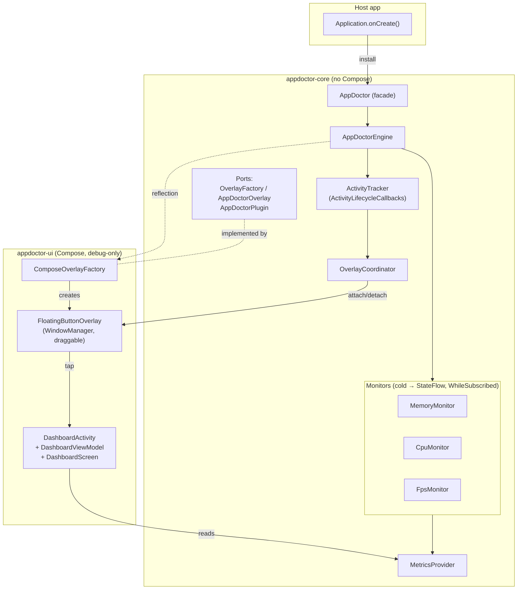

# 🩺 AppDoctor

**A zero‑config, debug‑only diagnostics overlay for Android.**
One line in your `Application` gives you a draggable floating button on every screen that opens a live dashboard of **device info, app info, memory, FPS, CPU, network requests, database queries, Compose runtime, deterministic health diagnostics and a unified timeline** — and it compiles to **nothing** in release builds.

```kotlin
class MyApp : Application() {
    override fun onCreate() {
        super.onCreate()
        AppDoctor.install(this)   // that's it
    }
}
```

> Phase 7 complete. Built with Kotlin, Jetpack Compose and Clean Architecture.

---

## ✨ Features

| | Feature | Notes |
|---|---|---|
| 🎈 | **Floating debug button** | Appears automatically on **every** Activity. Draggable, edge‑aware, and **never intercepts touches outside itself**. |
| 📊 | **Compose dashboard** | Opens on tap. Fully Jetpack Compose, self‑themed (looks identical in every host app). |
| 📱 | **Device Info** | Android version, API level, manufacturer, model, brand, ABI. |
| 📦 | **App Info** | Version name, version code, build type, package, min/target SDK. |
| 🧠 | **Memory monitor** | Used / max heap / free / native, heap %, refreshed every second. |
| 🎞️ | **FPS monitor** | Current, average and lowest FPS, updated live via `Choreographer`. |
| ⚙️ | **CPU monitor** | Approximate process CPU %, sampled from `/proc/self/stat` every second. |
| 🌐 | **Network Inspector** | OkHttp interceptor + dashboard tab with search/filter/sort, headers/body/timing details, copy/share/export actions. |
| 🗄️ | **Database Inspector** | Runtime SQL metrics for Room/SQLite: query, type, duration, rows, success, thread, transaction — plus optional analytics. Dashboard tab with search/filter/sort + copy/export. |
| 🧬 | **Compose Inspector** | Runtime Compose metrics via **stable** APIs: recompositions, rate, burst durations, composition/frame counts — plus opt-in per-composable tracking and optional analytics. Dashboard tab with lightweight charts. |
| 🩺 | **AppDoctor Intelligence (Diagnostics)** | Optional pure-Kotlin rule engine (`appdoctor-diagnostics`) that consumes collector metrics, computes deterministic health scores, detects issues with confidence, and powers the Health tab. |
| 🕒 | **Timeline Engine** | Optional observational event stream (`appdoctor-timeline`) that correlates collector and diagnostics activity into a chronological session timeline with filtering/search/export. |
| 🧾 | **Session Reports** | Optional local report runtime (`appdoctor-session`) that aggregates metadata, timeline, diagnostics, health, collector summaries and analytics into JSON/Markdown/ZIP exports. |
| 🔌 | **Programmatic control** | `enable()`, `disable()`, `isEnabled()`. |
| 🚫 | **Release‑safe** | Complete **no‑op** in non‑debuggable builds — no lifecycle callbacks, monitors, or overlay are ever created. |

---

## 🏗️ Architecture

AppDoctor follows **Clean Architecture** with strict separation between a UI‑agnostic core and a swappable Compose UI, wired together through the **Dependency Inversion Principle**.



**Key design points**

- **No static Activity references.** The current Activity is tracked with a `WeakReference` via `ActivityLifecycleCallbacks`; the overlay coordinator holds only weak references and detaches on `onPause`.
- **DIP seam.** `appdoctor-core` knows nothing about Compose. It talks to an `OverlayFactory` port. The `appdoctor-ui` module provides `ComposeOverlayFactory`, discovered **reflectively** so `install()` needs zero configuration — or inject your own via `AppDoctorConfig.overlayFactory`.
- **Lazy monitors = minimal CPU.** Each monitor is a cold flow shared with `stateIn(scope, WhileSubscribed(), …)`. Polling and the `Choreographer` callback only run **while the dashboard is open**. An idle app pays nothing.
- **Thread‑safe & lifecycle‑aware.** The public facade is safe to call from any thread; the dashboard uses `collectAsStateWithLifecycle` so metrics stop when it leaves the foreground.

See [`docs/ARCHITECTURE.md`](docs/ARCHITECTURE.md) for a deeper dive and the full extension‑point design.

### Modules

| Module | Type | Responsibility | Compose? |
|---|---|---|---|
| **`appdoctor-core`** | Android library | Public API, engine, lifecycle, monitors, ports, plugin SPI. | ❌ |
| **`appdoctor-ui`** | Android library | Floating button overlay + Compose dashboard. Implements the core ports. | ✅ |
| **`appdoctor-network`** | Android library | OkHttp interception, bounded request store, and Network dashboard tab plugin. | ✅ |
| **`appdoctor-database`** | Android library | SupportSQLite/Room query instrumentation, bounded query store, optional analytics, and Database dashboard tab plugin. | ✅ |
| **`appdoctor-compose`** | Android library | Stable-API Compose runtime metrics (recomposer + Choreographer), opt-in per-composable tracking, optional analytics, and Compose dashboard tab plugin. | ✅ |
| **`appdoctor-diagnostics`** | Android library | Optional diagnostics runtime: deterministic issue/rule engine, confidence, lifecycle, recommendations, health scoring. | ❌ |
| **`appdoctor-timeline`** | Android library | Optional observational timeline runtime: event capture, grouping, filtering/search, JSON/Markdown export. | ❌ |
| **`appdoctor-session`** | Android library | Optional local session report runtime: aggregation + export (`JSON`/`Markdown`/`ZIP`) + bounded report storage. | ❌ |
| **`sample-app`** | Android app | Demonstrates the one‑line integration. | ✅ |

---

## 📥 Installation

AppDoctor is a multi‑module project. Integrate it so the **tiny, self‑gating core** ships in all variants while the **heavy Compose UI is debug‑only**:

```kotlin
dependencies {
    implementation(project(":appdoctor-core"))     // small; no‑op in release
    debugImplementation(project(":appdoctor-ui"))  // Compose overlay, debug builds only
    debugImplementation(project(":appdoctor-network")) // Network inspector plugin + UI tab
    debugImplementation(project(":appdoctor-database")) // Database inspector plugin + UI tab
    debugImplementation(project(":appdoctor-compose")) // Compose runtime inspector plugin + UI tab
    debugImplementation(project(":appdoctor-diagnostics")) // Optional diagnostics intelligence + Health tab data
    debugImplementation(project(":appdoctor-timeline")) // Optional timeline engine + Timeline tab data
    debugImplementation(project(":appdoctor-session")) // Optional local session report generation/export
}
```

> **Why this split?** `AppDoctor.install()` lives in `core`, so it compiles in every variant, but in release `core` detects the app is not debuggable and returns immediately. The overlay code in `ui` isn't even present in release. You get the best of both worlds: a clean call site and zero release footprint.

**Requirements**

- `minSdk` **24+**
- AGP **9.0+** (uses built‑in Kotlin), Gradle **9.x**, JDK **17+**
- Jetpack Compose (host app themes are not required — the dashboard is self‑themed)

---

## 🚀 Quick start

```kotlin
class MyApp : Application() {
    override fun onCreate() {
        super.onCreate()
        AppDoctor.install(this)
    }
}
```

Run a **debug** build and you'll see the floating 🩺 button. Drag it anywhere; tap it for the dashboard.

### Network interception (OkHttp)

`appdoctor-network` auto-registers `AppDoctorNetworkPlugin` when present on the classpath (unless `captureNetwork = false`).  
Add its interceptor to your OkHttp client:

```kotlin
val networkPlugin = AppDoctorNetworkPlugin.installed()
val client = OkHttpClient.Builder().apply {
    networkPlugin?.let { addInterceptor(it.createInterceptor()) }
}.build()
```

### Database inspection (Room)

`appdoctor-database` auto-registers `AppDoctorDatabasePlugin` when present on the classpath (unless `captureDatabase = false`).  
Enable it on your Room builder:

```kotlin
import com.appdoctor.database.enableAppDoctor

val db = Room.databaseBuilder(context, AppDatabase::class.java, "app.db")
    .enableAppDoctor()
    .build()
```

Opt into runtime analytics with `AppDoctorConfig(enableDatabaseAnalytics = true)`. See [`docs/DATABASE.md`](docs/DATABASE.md).

### Compose runtime inspection

`appdoctor-compose` auto-registers `AppDoctorComposePlugin` when present on the classpath (unless `captureCompose = false`).
Global runtime metrics (recompositions, rate, burst durations, composition/frame counts) appear under the **Compose** tab with **no code changes** — they are read entirely from **stable, public** Compose APIs (`Recomposer.runningRecomposers` + `Choreographer`).

To observe individual composables, opt in with `AppDoctorConfig(enableComposableTracking = true)` and drop a call inside the composable you want to watch:

```kotlin
@Composable
fun ProductCard(product: Product) {
    TrackRecompositions("ProductCard") // no-op unless tracking is enabled
    // …your UI…
}
```

Opt into aggregate analytics with `AppDoctorConfig(enableComposeAnalytics = true)`. See [`docs/COMPOSE.md`](docs/COMPOSE.md).

Session reports are disabled by default; enable with
`AppDoctorConfig(enableSessionReports = true)`. See
[`docs/SESSION_REPORTS.md`](docs/SESSION_REPORTS.md).

### Configuration (optional)

```kotlin
AppDoctor.install(
    application = this,
    config = AppDoctorConfig(
        startEnabled = true,             // start hidden with false, then call enable()
        pollingIntervalMillis = 1_000L,  // memory & CPU sample interval
        captureNetwork = true,
        captureRequestBody = true,
        captureResponseBody = true,
        maxCapturedBodyBytes = 262_144,
        maxRequests = 100,
        captureDatabase = true,          // install the database inspector
        maxDatabaseQueries = 100,        // bounded query history
        slowQueryThresholdMillis = 16L,  // "slow" query threshold (≈ one frame)
        enableDatabaseAnalytics = false, // opt in to runtime analytics
        captureCompose = true,           // install the Compose inspector
        enableComposableTracking = false, // opt in to per-composable tracking
        trackedComposableLimit = 200,    // bounded tracked-composable history
        enableComposeAnalytics = false,  // opt in to Compose analytics
        enableDiagnostics = false,       // opt in to diagnostics intelligence
        analysisInterval = 2_000L, // diagnostics rule evaluation cadence
        maximumIssueHistory = 200,       // bounded diagnostics issue history
        minimumConfidence = 55,          // confidence gate for publishing issues
        enableTimeline = false,          // opt in to timeline capture
        maximumTimelineEvents = 1_000,   // bounded timeline history
        timelineGroupingWindowMillis = 2_000L, // temporal grouping window
        enableSessionReports = false,    // opt in to local session reports
        maximumStoredReports = 10,       // bounded in-memory stored report history
        autoGenerateOnCrash = false,     // placeholder (no crash auto-generation yet)
    ),
)
```

---

## 🧩 Public API

| Member | Description |
|---|---|
| `AppDoctor.install(application, config = AppDoctorConfig())` | Installs AppDoctor. Idempotent. **No‑op in release** unless `config.enabledInReleaseBuilds = true`. |
| `AppDoctor.enable()` | Shows the overlay and starts monitoring. |
| `AppDoctor.disable()` | Hides the overlay and stops monitoring (install remains). |
| `AppDoctor.isEnabled(): Boolean` | Whether the overlay is currently active. |
| `AppDoctor.isInstalled(): Boolean` | Whether `install()` took effect in this build. |
| `AppDoctor.registerPlugin(plugin)` | Registers an `AppDoctorPlugin` at runtime (extension point). |
| `AppDoctor.plugins: List<AppDoctorPlugin>` | Snapshot of registered plugins. |
| `AppDoctor.plugin(id: String): AppDoctorPlugin?` | Resolve a plugin by ID. |
| `AppDoctor.metrics: MetricsProvider?` | Live metrics for the UI / plugins; `null` if inactive. |

Every public symbol carries **KDoc**, and the module is compiled with **`explicitApi()`** for a clean, intentional ABI.

---

## 🛡️ Release safety, in detail

AppDoctor decides whether to activate by reading the host app's `ApplicationInfo.FLAG_DEBUGGABLE` — no build‑variant wiring required from you:

1. `install()` checks `isDebuggable`. In a release (non‑debuggable) build it logs one line and returns. **Nothing is constructed.**
2. Because the Compose UI is added with `debugImplementation`, the overlay classes aren't even in your release APK.
3. If you *deliberately* want AppDoctor in a non‑debuggable flavor (e.g. internal QA), set `AppDoctorConfig(enabledInReleaseBuilds = true)`.

This repo verifies the guarantee: `:sample-app:assembleRelease` compiles and packages **without** `appdoctor-ui` on the classpath.

---

## ⚡ Performance

- **Idle cost ≈ 0.** Monitors are `WhileSubscribed` flows; nothing polls until the dashboard is open.
- **Overlay is a plain `View`,** not Compose — negligible memory, no recomposition, works over any Activity type without `ViewTree*Owner` plumbing.
- **Recomposition‑friendly dashboard.** Each metric section collects its own `StateFlow`, so a memory tick doesn't recompose the FPS section.
- **No permissions.** The button lives in the app's own window (`TYPE_APPLICATION`), so **no `SYSTEM_ALERT_WINDOW`** is needed, and `FLAG_NOT_TOUCH_MODAL` lets touches outside the button pass straight through.

---

## 🔮 Extending AppDoctor (future‑proofing)

Phase 1 ships a stable plugin SPI so later capabilities slot in **without touching core**:

```kotlin
class NetworkInspectorPlugin : AppDoctorPlugin {
    override val id = "network-inspector"
    override val title = "Network"
    override fun onInstall(context: PluginContext) { /* hook OkHttp, expose flows */ }
    override fun onEnable() { /* start capturing */ }
    override fun onDisable() { /* pause */ }
}

AppDoctor.registerPlugin(NetworkInspectorPlugin())
```

Planned extension points on the roadmap:

- 🧩 **Plugin System** — third‑party tabs discovered via the same SPI.

---

## ▶️ Sample app

The [`sample-app`](sample-app) module demonstrates the full integration:

- One‑line `AppDoctor.install(this)` in [`SampleApplication`](sample-app/src/main/java/com/example/appdoctor/SampleApplication.kt).
- A button to **toggle** AppDoctor at runtime (`enable`/`disable`).
- A **second Activity** proving the overlay follows the foreground screen.
- A **"heavy work"** button so you can watch the CPU/FPS meters react.

```bash
./gradlew :sample-app:installDebug   # build & install on a device/emulator
```

---

## 🔨 Building from source

```bash
./gradlew :sample-app:assembleDebug      # debug APK (with overlay)
./gradlew :sample-app:assembleRelease    # release APK (AppDoctor stripped/no‑op)
./gradlew test                           # unit tests
./gradlew lint                           # Android lint
```

**Toolchain used:** AGP 9.2.1 · Gradle 9.4.1 · JDK 21 toolchain · Kotlin 2.2.10 (AGP built‑in) · Compose BOM 2026.06.01 · `minSdk` 24 / `compileSdk` 37.

---

## 🗺️ Roadmap

- [x] **Phase 1 — MVP:** floating button, dashboard, device/app/memory/FPS/CPU, plugin SPI.
- [x] **Phase 2:** Network Inspector ✅.
- [x] **Phase 3:** Database (Room) runtime inspector ✅ — SQL metrics + optional analytics.
- [x] **Phase 4:** Compose runtime inspector ✅ — recomposition/frame metrics, opt-in tracking + optional analytics.
- [x] **Phase 5:** AppDoctor Intelligence ✅ — optional diagnostics module, deterministic health scoring, issue engine, confidence and Health dashboard tab.
- [x] **Phase 6:** Timeline Engine ✅ — optional observational session timeline with filtering/search/grouping/export.

---

## 📄 License

Released under the **MIT License**. See [`LICENSE`](LICENSE).
