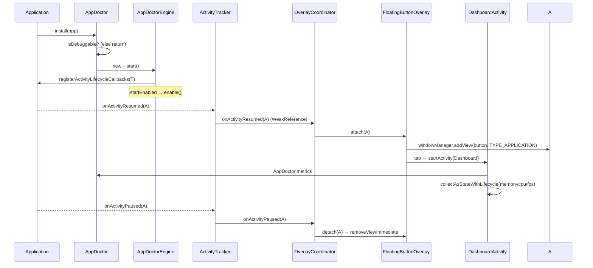

# AppDoctor — Architecture

This document explains how AppDoctor is put together, why the boundaries are where they
are, and where future features plug in. It complements the high‑level overview in the
[README](../README.md).

---

## 1. Goals that shaped the design

| Goal | Consequence in the code |
|---|---|
| **One‑line install** | A single `object AppDoctor` facade; the UI is discovered by reflection. |
| **Nothing in release** | `install()` gates on `FLAG_DEBUGGABLE`; UI ships via `debugImplementation`. |
| **No leaks** | `WeakReference`/`WeakHashMap` only; `ActivityLifecycleCallbacks`; no static Activity refs. |
| **Minimal CPU** | Monitors are cold flows shared with `WhileSubscribed` — they run only while observed. |
| **Swappable UI / testable** | Core depends on **ports** (`OverlayFactory`), not Compose (Dependency Inversion). |
| **Extensible** | A stable `AppDoctorPlugin` SPI is present from Phase 1. |

---

## 2. Module boundaries

```
┌──────────────────────────────────────────────────────────────────┐
│ sample-app  (com.android.application)                                 │
│   SampleApplication → AppDoctor.install(this)                         │
│   implementation(appdoctor-core) + debugImplementation(ui/net/db)     │
└───────────────┬───────────────────────────────┬──────────────────────┘
                │ (all variants)                 │ (debug only)
                ▼                                 ▼
┌───────────────────────────────┐   ┌────────────────────────────────────┐
│ appdoctor-core  (library)     │   │ appdoctor-ui / -network / -database  │
│  • AppDoctor (facade)         │   │    / -compose / -diagnostics / -timeline / -session / -ai │
│  • AppDoctorEngine            │◀──┤  • Compose overlay + dashboard      │
│  • ActivityTracker            │   │  • Network tab plugin + interceptor │
│  • OverlayCoordinator         │   │  • Database tab plugin + SQLite wrap │
│  • Monitors (mem/cpu/fps)     │   │  • Compose tab plugin + runtime probes │
│  • Diagnostics engine + Health model   │
│  • Timeline engine + correlation/export │
│  • MetricsProvider            │──▶│  • Material3 plugin tab rendering   │
│  • Ports + Plugin SPI         │   │  (reads metrics & plugin data)      │
│  NO Compose, NO UI            │   │                                      │
└───────────────────────────────┘   └────────────────────────────────────┘
```

The `appdoctor-network`, `appdoctor-database`, `appdoctor-compose`,
`appdoctor-diagnostics`, `appdoctor-timeline`, `appdoctor-session`, and `appdoctor-ai` modules are all
debug-only optional modules discovered via `ServiceLoader`; none requires any
`appdoctor-core` change.

- **`appdoctor-core`** compiles with `explicitApi()` and depends only on `kotlinx‑coroutines`
  and `androidx.core`. It never references Compose or any concrete UI.
- **`appdoctor-ui`** `api`‑exposes core (so a consumer gets the public API transitively) and
  contains everything Compose/`WindowManager`.
- The dependency arrow between UI and core only ever points **UI → core**. Core reaches UI
  exclusively through interfaces it owns, resolved at runtime.

---

## 3. The Dependency‑Inversion seam

Core defines two ports:

```kotlin
interface OverlayFactory { fun create(context: Context): AppDoctorOverlay }
interface AppDoctorOverlay { fun attach(a: Activity); fun detach(a: Activity); fun release() }
```

`AppDoctorEngine.resolveOverlay()` obtains an implementation in one of three ways:

1. **Explicit** — `AppDoctorConfig.overlayFactory` (great for tests / custom UIs).
2. **Reflection** — `Class.forName("com.appdoctor.ui.ComposeOverlayFactory")` when the UI
   module is present. This is what makes zero‑config `install()` possible.
3. **Headless** — if neither is available, core still runs the monitors (metrics‑only) and
   simply has no button. No crash.

This is the classic Clean‑Architecture rule: the inner layer (core) declares the interface,
the outer layer (ui) implements it, and wiring happens at the boundary.

---

## 4. Lifecycle & overlay flow



**Leak safety.** `ActivityTracker` stores the resumed Activity in a `WeakReference` and
clears it on pause. `OverlayCoordinator` and `FloatingButtonOverlay` (via `WeakHashMap`)
hold Activities weakly and always remove their view on pause/destroy. AppDoctor's own UI
Activities (`com.appdoctor.ui.*`) are skipped so the button never appears on the dashboard.

**Threading.** Lifecycle callbacks arrive on the main thread. Overlay/`WindowManager` work
is confined to a `Dispatchers.Main.immediate` scope. Monitor polling runs on
`Dispatchers.Default`; the FPS `Choreographer` callback runs on the main thread.

---

## 5. Monitors — why they cost ~0 while idle

Every monitor implements `Monitor<T>` and exposes a `StateFlow<T>` built like this:

```kotlin
override val data: StateFlow<T> =
    flow { while (true) { emit(read()); delay(interval) } }
        .flowOn(Dispatchers.Default)
        .stateIn(scope, SharingStarted.WhileSubscribed(2_000), initial)
```

`WhileSubscribed` means the upstream (`while` loop / `Choreographer` registration) starts
only when the first collector subscribes and stops shortly after the last one leaves.
Since the **only** collector is the dashboard, closing the dashboard stops all sampling.

| Monitor | Source | Cadence |
|---|---|---|
| `MemoryMonitor` | `Runtime` heap + `Debug.getNativeHeapAllocatedSize()` | 1 s poll |
| `CpuMonitor` | delta of `utime+stime` from `/proc/self/stat` ÷ elapsed ÷ cores | 1 s poll |
| `FpsMonitor` | `Choreographer` frame deltas → current / windowed avg / lowest | per frame |

All collaborators (runtime, stat reader, choreographer, clocks) are constructor‑injected, so
each monitor is unit‑testable without a device (see `CpuMonitorParseTest`, `MemoryInfoTest`).

---

## 6. The UI layer

- **Floating button** is a plain `View` (not Compose) added to the Activity's own
  `WindowManager` with `TYPE_APPLICATION` — **no `SYSTEM_ALERT_WINDOW` permission**. The
  window is `WRAP_CONTENT` with `FLAG_NOT_TOUCH_MODAL | FLAG_NOT_FOCUSABLE`, so touches
  outside the button pass through. A plain View also avoids `ViewTree*Owner` plumbing and
  works over **any** Activity type, not just `ComponentActivity`.
- **Dashboard** is a real (non‑exported) `DashboardActivity` hosting pure Compose. Being an
  Activity gives it a proper lifecycle, back handling and `ViewModel` scope for free, and
  makes the metric flows stop automatically when it is backgrounded.
- **`DashboardViewModel`** receives the `MetricsProvider` through a factory (DI‑friendly) and
  re‑exposes the flows; composables never touch the core singleton directly.
- **Recomposition hygiene:** each section (`MemorySection`, `FpsSection`, `CpuSection`)
  collects its own `StateFlow`, so an update to one metric doesn't recompose the others.

---

## 7. Extension points (future‑proofing)

```kotlin
interface AppDoctorPlugin {
    val id: String
    val title: String
    fun onInstall(context: PluginContext)   // PluginContext: application, metrics, scope
    fun onEnable() {}
    fun onDisable() {}
}
```

Plugins are registered via `AppDoctorConfig.plugins` or `AppDoctor.registerPlugin(...)`.
`AppDoctorEngine` installs them, mirrors enable/disable, and guards every callback so a
faulty plugin can't crash the host. This single seam is how the roadmap items land without
modifying core:

- 🌐 **Network Inspector** — delivered in `appdoctor-network` (OkHttp interceptor + Network tab).
- 🗄️ **Database Inspector** — delivered in `appdoctor-database`: runtime SQL metrics via a
  delegating `SupportSQLiteOpenHelper.Factory` (Room `enableAppDoctor()`), a bounded query
  store, an optional decoupled analytics engine, and a Database tab.
- 🧬 **Compose Inspector** — delivered in `appdoctor-compose`: stable-API runtime metrics
  (`Recomposer.runningRecomposers` + `Choreographer`), opt-in per-composable tracking via a
  process-wide sink, an optional decoupled analytics engine, and a Compose tab. No experimental
  Compose APIs and no reflection into Compose internals.
- 🩺 **Diagnostics Intelligence** — delivered in `appdoctor-diagnostics`: a pure-Kotlin
  asynchronous rule engine that reads `CollectorRegistry` snapshots, computes deterministic
  health scores, opens/updates/resolves issues with confidence, and powers the Health tab.
- 🕒 **Timeline Engine** — delivered in `appdoctor-timeline`: a pure observational layer
  that asynchronously consumes collector snapshots plus diagnostics issue updates, records
  a bounded chronological event stream, groups near-time events, and exports JSON/Markdown.
- 🧾 **Session Reports** — delivered in `appdoctor-session`: a pure aggregation layer that
  asynchronously samples collector snapshots, consumes optional timeline/diagnostics outputs,
  builds session metadata + summaries, and exports local JSON/Markdown/ZIP reports.
- 🤖 **AI Analysis** — delivered in `appdoctor-ai`: a pure `SessionReport`-consumer module
  that never touches collectors directly, applies sanitization/redaction before optional
  provider calls, caches by session id, and exports local JSON/Markdown analyses.
- 🧩 **Plugin System** — third‑party plugins discovered via the same SPI (and, later,
  `ServiceLoader`/manifest metadata) so they need no core changes at all.

The dashboard is intentionally sectioned so a future `PluginSection` can render each
registered plugin's `title` + content with no structural change.

---

## 7a. Collector infrastructure (metrics platform)

Every runtime metric is exposed through a small, UI-free contract in `appdoctor-core`:

```kotlin
interface Metric                                   // marker; MemoryInfo/CpuInfo/FpsInfo implement it
interface MetricCollector<out T : Metric> {        // id + live StateFlow + snapshot()
    val id: String
    val data: StateFlow<T>
    fun snapshot(): T = data.value
}
interface CollectorRegistry {                       // read-only: enumerate + lookup by id
    val collectors: List<MetricCollector<Metric>>
    fun collector(id: String): MetricCollector<Metric>?
}
```

- Existing monitors are **adapted** (not rewritten) via the internal `MonitorCollector`,
  which re-exposes the monitor's own hot `StateFlow` verbatim (zero extra sampling).
- Plugins contribute collectors by implementing the optional `MetricCollectorProvider`;
  `AppDoctorEngine` registers them automatically on install (Interface Segregation — a
  tab-only plugin need not implement it).
- Access the read-only registry via `AppDoctor.collectors`. Stable ids: `memory`, `cpu`,
  `fps`, `network`, `database`, `compose`.
- Discovery is `java.util.ServiceLoader`-based: modules self-register an `OverlayFactory`
  and/or an `AppDoctorPluginFactory` under `META-INF/services`, so core needs **no edits**
  when a new collector module (the Phase 3 Database module, the Phase 4 Compose module) is
  added. AGP merges the per-module service files, so multiple inspector modules coexist.

`StateFlow` remains the primary live stream; `snapshot()` is the point-in-time read for
future Timeline / Session Reports / Diagnostics. No Diagnostics/AI/rule types are introduced
here — this is only the collector substrate.

---

## 8. Package map

```
appdoctor-core/…/com/appdoctor/core/
├── AppDoctor.kt                 facade (public API)
├── AppDoctorConfig.kt           configuration
├── MetricsProvider.kt           read‑only metrics aggregate (port)
├── info/                        DeviceInfo(+Provider), AppInfo(+Provider)
├── monitor/                     Monitor<T>
│   ├── memory/                  MemoryInfo, MemoryMonitor
│   ├── cpu/                     CpuInfo, CpuMonitor
│   └── fps/                     FpsInfo, FpsMonitor
├── overlay/                     OverlayFactory, AppDoctorOverlay (ports)
├── plugin/                      AppDoctorPlugin, PluginContext (SPI)
└── internal/                    AppDoctorEngine, OverlayCoordinator,
                                 lifecycle/ActivityTracker, util/*

appdoctor-ui/…/com/appdoctor/ui/
├── ComposeOverlayFactory.kt     port impl (reflection entry point)
├── overlay/FloatingButtonOverlay.kt
├── dashboard/                   DashboardActivity, DashboardViewModel, DashboardScreen
│   └── components/              SectionCard, InfoRow, MetricBar
│   └── plugin/                  DashboardTabPlugin
├── theme/                       AppDoctorTheme, AppDoctorTokens
└── format/                      Formatters

appdoctor-network/…/com/appdoctor/network/
├── AppDoctorNetworkPlugin.kt    plugin + tab registration surface
├── okhttp/                      AppDoctorNetworkInterceptor
├── repository/                  bounded in-memory request store
├── model/                       immutable network transaction models
└── ui/                          NetworkTabScreen (filters/details/actions)

appdoctor-database/…/com/appdoctor/database/
├── AppDoctorDatabasePlugin.kt   plugin + tab registration surface
├── AppDoctorDatabase.kt         global recorder sink + factory wrapper
├── RoomDatabaseExtensions.kt    RoomDatabase.Builder.enableAppDoctor()
├── internal/sqlite/             SupportSQLite Proxy + statement/cursor wrappers, txn tracker
├── recorder/                    QueryExecution → DatabaseQueryRecorder → repository
├── repository/                  bounded in-memory query store
├── metric/                      DatabaseMetricCollector (adapter, no analytics)
├── analytics/                   pure Computer + live Engine (optional, decoupled)
├── model/                       DatabaseQuery, QueryType, DatabaseMetric
└── ui/                          DatabaseTabScreen + analytics section

appdoctor-compose/…/com/appdoctor/compose/
├── AppDoctorComposePlugin.kt    plugin + tab registration surface
├── AppDoctorCompose.kt          process-wide tracking sink + optional screen name
├── Tracking.kt                  TrackRecompositions / TrackScreen / LocalComposeTrackingDepth
├── internal/runtime/            Recomposer + Choreographer probes, engine, pure helpers
├── tracking/                    bounded in-memory composable tracker
├── metric/                      ComposeMetricCollector (adapter, no analytics)
├── analytics/                   pure Computer + live Engine (optional, decoupled)
├── model/                       ComposeRuntimeSnapshot, TrackedComposable
├── internal/                    ComposeFormatter
└── ui/                          ComposeTabScreen + analytics section + lightweight charts

appdoctor-diagnostics/…/com/appdoctor/diagnostics/
├── AppDoctorDiagnosticsPlugin.kt      plugin runtime + state flows
├── AppDoctorDiagnosticsPluginFactory.kt ServiceLoader registration gate
├── model/                             HealthReport + DiagnosticIssue model
└── engine/                            DiagnosticsEngine, rules, confidence, lifecycle store

appdoctor-timeline/…/com/appdoctor/timeline/
├── AppDoctorTimelinePlugin.kt         plugin runtime + timeline API
├── AppDoctorTimelinePluginFactory.kt  ServiceLoader registration gate
├── model/                             TimelineEvent, TimelineSession, TimelineFilter
└── engine/                            TimelineEngine, repository, grouping, search, exporter

appdoctor-session/…/com/appdoctor/session/
├── AppDoctorSessionPlugin.kt          plugin runtime + public manager API
├── AppDoctorSessionPluginFactory.kt   ServiceLoader registration gate
├── SessionManager.kt                  generate/save/share/export facade
├── model/                             SessionReport + metadata/sections
└── engine/                            recorder, builder, formatter, exporter, repository

appdoctor-ai/…/com/appdoctor/ai/
├── AppDoctorAiPlugin.kt               plugin runtime + AI Analysis tab surface
├── AppDoctorAiPluginFactory.kt        ServiceLoader registration gate
├── AiProvider.kt                      provider abstraction (openai/gemini/local/custom/3p)
├── sanitize/                          report sanitizer pipeline + built-ins
├── provider/                          built-in provider implementations
├── engine/                            prompt/analyzer/cache/history/export + orchestration
└── ui/                                AI tab UI (generate/refresh/history/copy/share/export)
```
